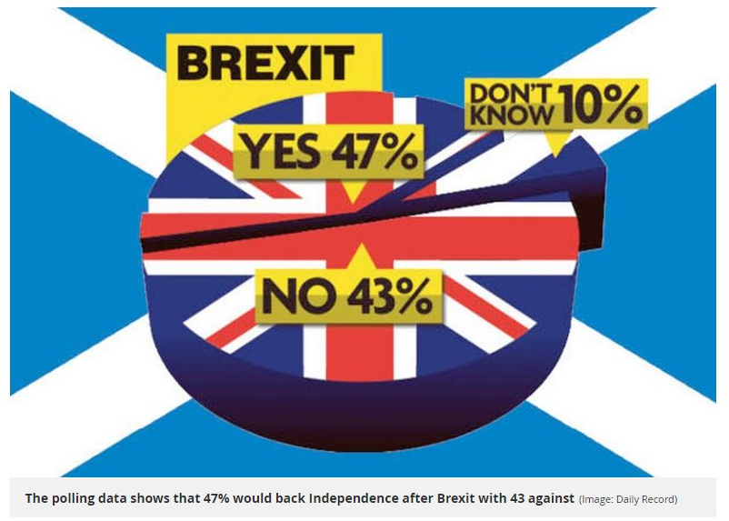
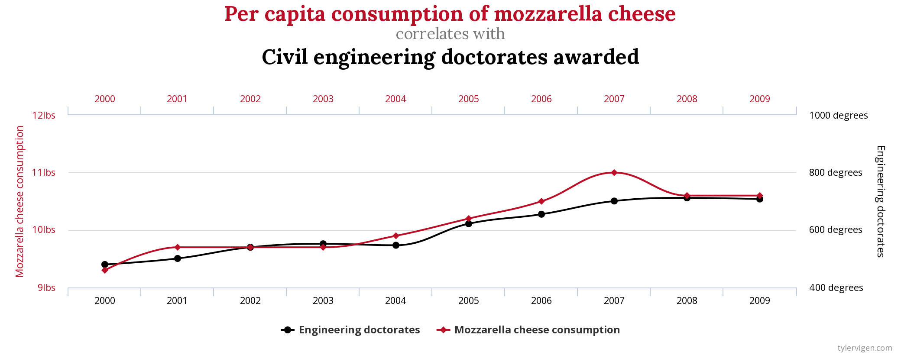

## Get started

### Clone a repo + start a new project 

Go to the `inclass01-[GITHUB USERNAME]` repo, clone it, and start a new project in RStudio. See earlier labs and application exercises for more detailed instructions.

### Configure git

Run the following code to configure Git. Fill in your GitHub username and the email address associated with your GitHub account. 

```{r eval=FALSE}
library(usethis)
use_git_config(user.name = "sburstein", user.email ="scott.burstein@duke.edu")
```

# Data Science Ethics Discussion

## Discussion guidelines 

- Listen respectfully. Listen actively and with an ear to understanding others' views. 
- Criticize ideas, not individuals.
- Commit to learning, not debating. Comment in order to share information, not to persuade.
- Avoid blame, speculation, and inflammatory language.
- Avoid assumptions about any member of the class or generalizations about social groups.


## Data representation

### Misleading data visualizations^[Source: https://humansofdata.atlan.com/2019/02/dos-donts-data-visualization/]

#### What baby boomers think

```{r echo = F, fig.align = "center", out.width = "35%"}

```

- What is the graph trying to show? 
How baby boomers perceive themselves across a range of different qualities.

- Why is this graph misleading? 
The form of the graphic (a human figure) makes the poll results unclear. Different parts of the body look larger than others despite having a smaller % value. Overall poor quality layout, and the human does not add up to 100%.

- How can you improve this graph? 
Isolate each question and view relevant data independently.

<br>

#### Brexit 

```{r echo = F, fig.align = "center", out.width = "35%"}

```

- What is the graph trying to show? 
Sentiment about cessation from E.U. post Brexit amongst Scottish citizens.

- Why is this graph misleading? 
Appears to be about British sentiment towards Brexit which is false.

- How can you improve this graph? 
Make background and muddled graphics more clear. State research question and meaning of values.

### Spurious correlation^[Source: https://www.tylervigen.com/spurious-correlations]

```{r echo = F, fig.align = "center", out.width = "80%"}

```

- What is the graph trying to show? 
The percieved correlation between per capita mozzerella cheese consumption and Civil Engineering doctorate degrees awarded.

- Why is this graph misleading? 
While the trends may have similar patterns (both increase over multiple years), there is no plausible correlation that would form a causual relationship between these two trends.

### More reading on data visualization

- [From data to viz](https://www.data-to-viz.com/): Find appropriate graph for your data
- [A Reader on Data Visualization - Ethics](https://mschermann.github.io/data_viz_reader/ethics.html)

## Collecting + handling data^[Modified from [*Modern Data Science with R, 2nd Edition*](https://beanumber.github.io/mdsr2e/ch-ethics.html)] 

## Posting data from social media

A data analyst received permission to post a data set that was scraped from a social
media site. The full data set included name, screen name, email address, geographic location, IP (Internet protocol) address, demographic profiles, and preferences for relationships.
The analyst removes name and email address from the data set in effort to deidentify it. 

- Why might it be problematic to post this data set publicly?
It could still be possible to extract personal information from the dataset.

- How can you store the full dataset in a safe and ethical way? 
Be certain to remove all personal information and clean data. Do not post dataset publicly with any potentially revealing information (including IP addresses).

- You want to make the data available so your analysis is transparent and reproducible. How can you modify the full data set to make the data available in an ethical way?
Remove all but the most relevant variables of the dataset and be sure to review the set at large. Ask other data scientists and experts for consult before posting publicly.

  
- As you start working on data analyses for the STA 199 project, internships, research, etc., what are 1 - 2 things you can do to ensure you're doing the analysis in an ethical way? What lessons can you learn from the three examples discussed in the lecture content
video?

Be certain to isolate meaningful data and clean IP addresses, names, birth dates, etc. to avoid privacy violations.

# Review

```{r load-libraries, include = FALSE}
library(tidyverse)
library(nycflights13)  
```

## Six Key Verbs

- filter
- arrange
- select
- mutate
- summarize
- group_by

### filter(): Picks off rows / observations

```{r ex-01}
filter(flights, month == 1, day == 1)

flights %>% 
  filter(month == 1, day == 1)
```

1) How do the `filter` lines in the code chunk above differ?

There is no difference the second line just pipes `flights` into filter() as opposed to explicitly stating the dataset within the filter() function. The second syntax is more easily understood (read left to right).

2) Create 3 new data frames that include (a) only flights going to RDU, (b) flights that were on-time or better, and (c) flights going to RDU that were on-time or better.  

```{r ex-02}
flightsA <- flights %>%
  filter(dest == "RDU")

print(flightsA, width = Inf)

flightsB <- flights %>%
  filter(arr_delay <= 0)

flightsC <- flights %>%
  filter(dest == "RDU", arr_delay <= 0)

print(flightsC, width = Inf)
```


3) What would happen if you tried `filter(flights, month == 11, month == 12)`?  Make a prediction first.

The data set will be empty since no flights have both month == 11 and month == 12.

```{r ex-03}
flights %>%
  filter(flights, month == 11, month == 12)
```


4) How about `filter(flights, month = 11)`?  Make a prediction first.

Nothing will happen since you need the Boolean comparison operator ==.

```{r ex-04}
flights %>%
  filter(flights, month = 11)
```
As expected an error is returned.
"Error: Problem with `filter()` input `..2`.
x Input `..2` is named.
ℹ This usually means that you've used `=` instead of `==`.
ℹ Did you mean `month == 11`?"

5) Compare the number of flights who's arrival was delayed more than 1 hour in January to the number of flights delayed more than 1 hour in June.

```{r ex-05}
flights %>%
  filter(month == 1 & arr_delay > 60)

flights %>%
  filter(month == 6, arr_delay > 60)
```


6) Pick off all flights on American, Delta, or United.  

```{r ex-06}
flights %>%
  filter(carrier == "AA" | carrier == "UA" | carrier == "DL")

flights %>%
  filter(carrier %in% c("DL", "UA", "AA"))

```


7) Find all flights with missing departure time.

```{r ex-07}
flights %>%
  filter(is.na(dep_time)) %>%
  print(width = Inf)

```


8) NAs are sometimes thought of as being contagious.  Construct a general rule for how NAs are handled in R.  Consider examples like: `NA+5`, "NA>2", "NA^0", "NA | TRUE", "FALSE & NA", "NA*0".

```{r ex-08}
NA + 5
NA > 2
NA^0
NA | TRUE
FALSE & NA
NA*0

```
R returns NA for any operation with NA unless there is an explicit answer that is not dependent on the actual NA value. any value ^0 = 1, | TRUE is always TRUE, & FALSE is always FALSE.

### arrange(): order rows / observations in specific ways

9) Find the top 10 longest flights.  What do you notice?

```{r ex-09}
flights %>%
  arrange(desc(air_time)) %>%
  print(n = 10, width = Inf)

```


### select(): pick off certain columns / variables

10) Create a data set with all the variables that end with the letter "e" using the helper function `ends_with()`.

```{r ex-10}
flights %>%
  select(ends_with("e"))

```


11) What do you expect will happen if you use `select(flights, contains("time"))`?  Try it out to see if you were correct.

```{r ex-11}
flights %>%
  select(contains("time"))
```


### mutate(): create new variables from old

12) Add a variable for the average speed of the airplane in flight.  Be sure your new variable is in miles per hour.  Save the new data frame and plot a histogram of miles per hour.

```{r ex-12}
flights <- flights %>%
  mutate(hours = air_time / 60,
         mph = distance / hours)
print(flights, width = Inf)

ggplot(data = flights,
       mapping = aes(x = mph)) +
  geom_histogram()

```


### summarize(): generate summary statistics

13) Find the proportion of on-time flights by day.  Remember that a proportion is just the mean of a binary variable where 0 is No and 1 is Yes.

```{r ex-13}
flights %>%
  group_by(year, month, day) %>%
  summarize(ontime = mean(arr_delay <= 0, na.rm = TRUE)) %>%
  print(n = 31)

```


14) Use pipes to summarize the sample size, mean, and SD of flight distances by airplane (`tailnum`) and then pick off the top 5 and bottom 5 airplanes in terms of mean distance traveled per flight.

```{r ex-14}
flights %>%
  group_by(tailnum) %>%
  summarize(count = n(),
            mean_dist = mean(distance, na.rm = TRUE),
            sd_dist = sd(distance, na.rm = TRUE))

```

